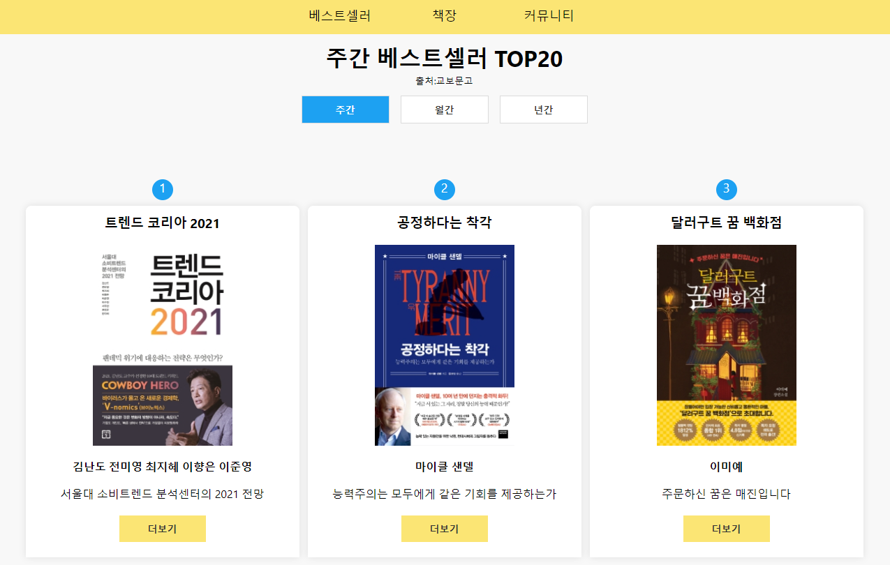
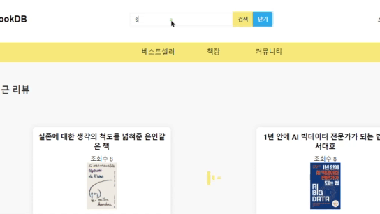
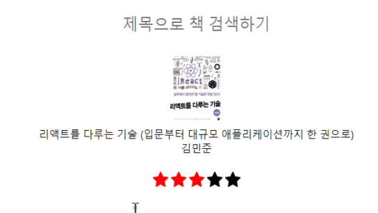
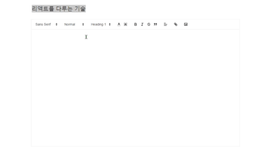

# BookDB

[홈페이지](https://bookdb.netlify.app/)
 

---

## Reason

#### **왜 시작됐는가?**

북디비의 시작은 다양한 책들을 간단하게 리뷰할 수 있는 사이트가 있었으면 좋겠다는 생각에서부터 시작했습니다.

#### **무엇을 하는 사이트인가?**

북디비는 실제 교보문고에 있는  베스트셀러들을 손쉽게 조회할 수 있고, 네이버 검색을 활용해 원하는 책들을 검색할 수 있습니다.

그리고 본인이 읽었던 책을 골라 블로그와 같은 형식으로 리뷰할 수 있습니다.

 

## Stack

#### **북디비는 다음과 같은 스택으로 구성되었습니다.**

1.서버사이드렌더링 및 검색 엔진 최적화를 경험하기 위한 <strong>Next.js</strong> 

2.타입의 안정성 확보 및 유지 보수를 위한 <strong>Typescript</strong>

3.중앙 상태 관리를 위한 <strong>Redux/Redux-Saga</strong>

4.서버사이드렌더링을 지원하는 스타일 <strong>Emotion</strong>

5.서버 구축을 위한 Node.JS의 <strong>Express</strong>

6.빠른 배포를 위한 <strong>heroku&netlify</strong>

 
 

## Structure

#### 주요 폴더 구조는 다음과 같습니다.

-   @types
    -   공통되는 타입들을 전역적으로 사용하기 위해 한 데로 묶어 관리하는 폴더입니다.
-   components
    -   기본적으론 **페이지 별로 보여지는 UI 컴포넌트**를 담당하는 폴더입니다.
    -   common 폴더에선 UI는 물론 **공통적으로 사용되는 컴포넌트의 로직**도 관리합니다.
    -   Layouts 폴더에선 **Nav나 Header, Footer 등 레이아웃**을 관리합니다.
-   head
    -   **메타 태그 설정**을 관리하는 폴더입니다.
-   hook
    -   **커스텀 훅** 폴더입니다.
-   pages
    -   Next에서 라우터 기능을 담당하는 폴더이며, **페이지 별 주요 로직**은 이곳에 있습니다.
-   redux
    -   **리덕스 폴더**입니다. ducks패턴을 사용했습니다.
-   sagas

    -   **리덕스 사가 폴더**입니다. 리덕스 폴더 내에 있는 파일명과 통일시켜 혼동을 줄였습니다.

-   store
    -   **리덕스 스토어 설정** 폴더입니다.
-   styles
    -   **공통된 스타일**을 담당합니다.
    -   loader, Emotion theme, global style, commonStyle 파일이 있습니다.

 
 

## Feature

<ul>
<li><a href="#crawling"> 크롤링</a></li>
<li><a href="#search">실시간 검색 </a></li>
<li><a href="#rating">별점 평가 </a></li>
<li><a href="#scroll">인피니트 스크롤 </a></li>
<li><a href="#text">위지위그 에디터 </a></li>
</ul>

 
 

### <a style="color: black" id="crawling"> 크롤링</a>

 

북디비에서는 교보문고에서 크롤링한 최신 작가 인터뷰, 스테디셀러, 주간&월간&년간 베스트 셀러를 제공합니다.

데이터는 Node를 활용해 크롤링했으며 모듈은 cheerio, iconv-ite를 사용했습니다.

<small>*크롤링 코드는 서버에 존재합니다.</small>

 
  

 

### <a style="color: black" id="search">실시간 검색 </a>

 

네이버 검색 API를 사용해, 책을 검색할 수 있습니다. 
유저의 편의성을 위해 검색창에 검색어를 입력할 시, 실시간으로 검색 목록이 나타납니다.

 

 

### <a style="color: black" id="scroll">인피니트 스크롤 </a>

 

유저 경험을 고려해 인피니트 스크롤을 구현하여 페이지를 넘기지 않아도 컨텐츠를 볼 수 있도록 하였습니다.  
scroll 이벤트를 활용하던 기존의 방식 대신, 보다 효율적으로 구현하기 위해 IntersectionObserver API를 활용했습니다.

 

 

### <a style="color: black" id="rating">별점 평가 </a>

 

리액트 아이콘과 mouseOver 이벤트를 활용, 책 리뷰를 위해 별점 평가를 사용할 수 있는 별점 평가 기능을 구현했습니다.

 

### <a style="color: black" id="text">위지위그 에디터 </a>

 

quill에디터를 도입하여 이미지 업로드, 글자 크기, 글꼴의 변경 등 보다 상세한 글쓰기 기능을 구현 했습니다. 

 

## git commit

이번 프로젝트에서는 커밋의 내용을 쉽게 파악하기 위해 메시지 규칙을 정해 진행하였습니다.

-   Initialize : 초기 파일, 폴더 생성

-   Fix : 코드 수정

-   Refactor : 코드 최적화 및 컴포넌트 분할

-   Feat : 새로운 기능을 위한 코드 추가

-   Styling : css 등으로 스타일링

-   Correct : 오타 수정
